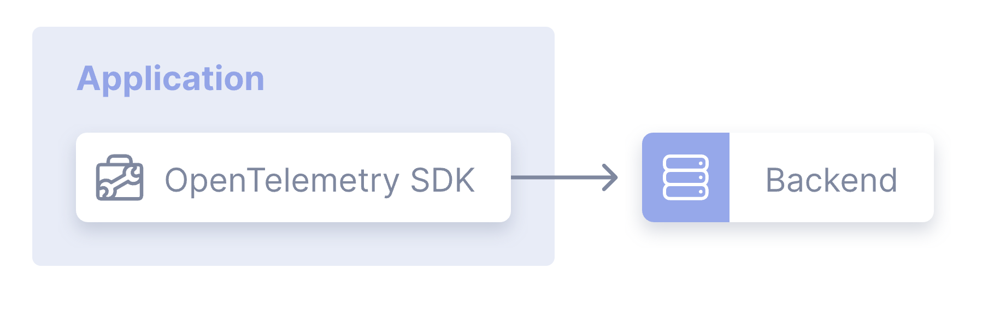
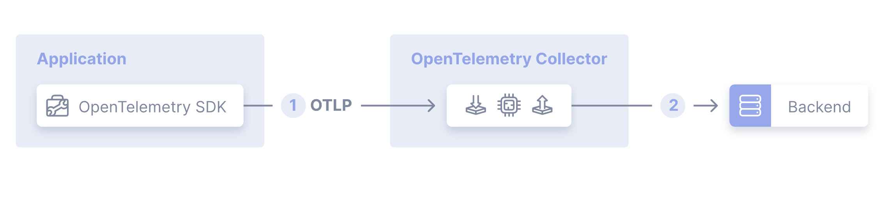
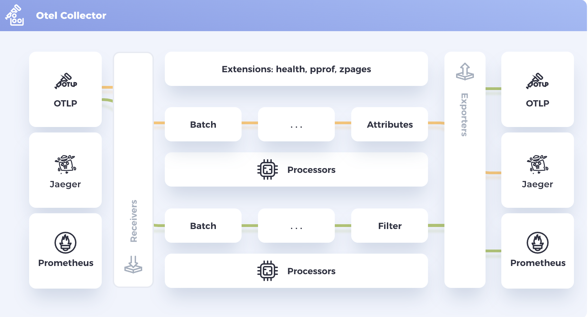

### Giriş

OpenTelemetry Collector, client'lar ile hedef sistemler arasında bir proxy gibi çalışarak, client'lardan merkezi olarak topladığı telemetry verilerini (metric, log, trace), çeşitli işlemlerden(filtreleme, transform vb.) geçirdikten sonra, farklı analiz veya gözlemlenebilirlik sistemlerine (örneğin Prometheus, Grafana, Jaeger, Loki, Datadog vs.) yönlendirmek için kullanılan açık kaynaklı, esnek ve genişletilebilir bir bileşendir.

Telemetry verilerini, hedef sistemlere aktarabilmek için collector kullanmak zorunlu değildir. Client'larımız, herhangi bir aracı sisteme ihtiyaç duymadan, telemetry verilerini doğrudan hedef sistemlere gönderebilirler. 



Çoğu zaman testlerde ve geliştirme sistemlerinde bu şekilde yapılır zaten. Ancak production ortamlarda çalışacak sistemler tasarladığımızda; 
- Hedef sistemler üzerindeki yükü azaltmak
- Hedef sistemleri client'lardan soyutlayarak güvenliği sağlamak
- Pek çok client üzerinde kullanılacak filtreleme, transform gibi işlemleri merkezi bir yerde yaparak, tekrarı engellemek
- Olası hedef sistem değişikliklerini tek tek client'lara uygulamaktansa merkezi bir yere uygulamak
gibi avantajlarından ötürü opentelemetry collector bileşeni kullanılması tavsiye edilir.




### Kurulum

Öncelikle bir konfigürasyon dosyası oluşturduk. Bu dosyanın içeriği şu aşamada önemli değil.

```
receivers:
  otlp:
    protocols:
      grpc:
        endpoint: 0.0.0.0:4317
      http:
        endpoint: 0.0.0.0:4318

processors:
  batch:

exporters:
  debug:
    verbosity: detailed
  otlp:
    endpoint: jaeger:4317
    tls:
      insecure: true

extensions:
  health_check:
    endpoint: 0.0.0.0:13133
  pprof:
    endpoint: 0.0.0.0:1888
  zpages:
    endpoint: 0.0.0.0:55679

service:
  extensions: [health_check, pprof, zpages]
  pipelines:
    traces:
      receivers: [otlp]
      processors: [batch]
      exporters: [debug,otlp]
    metrics:
      receivers: [otlp]
      processors: [batch]
      exporters: [debug,otlp]
    logs:
      receivers: [otlp]
      processors: [batch]
      exporters: [debug,otlp]
```

> [!NOT] [https://www.otelbin.io](https://www.otelbin.io/) sitesi üzerinden oluşturulan konfigürasyon dosyası doğrulanabilir ve konfigürasyon akışı görülebilir. 

```
docker run -d --name otelcollector -p 4317:4317 -p 4318:4318 -p 55679:55679 -p 1888:1888 -p 13133:13133 -p 8888:8888 -p 8889:8889 -v ./config.yaml:/etc/otelcol-contrib/config.yaml otel/opentelemetry-collector-contrib:0.126.0
```

> Docker container'ı çalıştığı anda,  `/otelcol-contrib --config /etc/otelcol-contrib/config.yaml ` çalıştırır.

Kurulum sırasında health_check, pprof ve zpages adında üç adet extension da kurduk. Bu extension'lar collector'un sağlık durumu ve anlık işleyişiyle ile ilgili bilgi almak amacıyla bazı endpointler sunarlar.

health_check extension'ı
```
GET http://localhost:13133

{ 
  "status": "Server available", 
  "upSince": "2025-02-26T08:32:38.459026194Z", 
  "uptime": "6m47.834073393s" 
}
```

zpages extension'ı
```
http://localhost:55679/debug/servicez 
http://localhost:55679/debug/pipelinez 
http://localhost:55679/debug/tracez 
http://localhost:55679/debug/featurez 
http://localhost:55679/debug/extensionz
```


pprof extension'ı
```
http://localhost:1888/debug/pprof 

go tool pprof http://localhost:1888/debug/pprof/profi
```

### Konfigürasyon




Collector pipeline’ını konfigüre ederken, 4 component grubu ayarından bahsedebiliriz.

1. Receivers
2. Processors
3. Exporters
4. Connectors

**Receivers**, telemetry verilerinin toplanacağı kaynakların tanımının yapıldığı kısımdır. Burada tanımlanan bir receiver,telemetry kaynağının çalışma prensibine göre, telemetry verilerinin kendisine gönderilmesini bekleyebilir (push) ya da receiver gidip kaynaktan telemetry verisini çekebilir (pull). Bir veya daha fazla receiver tanımı yapılabilir. En az bir tane yapılmalıdır.

Receiver tanımlarındaki çoğu kaynak çeşidi, collector tarafından öntanımlı olarak bilinir. Yani receiver tanımı yaparken, receiver’ın adını belirtmek onu yapılandırmak için yeterli olabilir. Örnek olarak, sadece zipkin dediğimizde, default olarak [localhost:9411](http://localhost:9411/) adresine bakar, eğer farklı konfigürasyon kullanacaksak belirtiriz ve default değer ezilir.

```yaml
receivers:
  otlp:
    protocols:
      grpc:
        endpoint: 0.0.0.0:4317
        tls:
          cert_file: cert.pem
          key_file: cert-key.pem
      http:
        endpoint: 0.0.0.0:4318

  prometheus:
    config:
      scrape_configs:
        - job_name: otel-collector
          scrape_interval: 5s
          static_configs:
            - targets: [localhost:8888]

  zipkin:
```

> Bir receiver tanımı yapıldığı zaman aktif olabilmesi için, `services` kısmında kullanılmalıdır.

**Processors**, receiverlar tarafından toplanan verileri, pipeline tanımında bulunan exporter’lara göndermeden önce üzerlerinde bazı operasyonlar yapabilmemizi sağlayan bileşenlerdir. Veriler üzerinde, filtreleme, yeniden isimlendirme, yeni attribute'lar ekleme gibi işlemler yapılabilir. 

Default olarak herhangi bir process işlemi gerçekleştirilmez, bu sebeple zorunlu bir section da değildir. 

https://github.com/open-telemetry/opentelemetry-collector-contrib/tree/main/processor adresinde kullanabileceğimiz processor'lerin bir listesi vardır. 

```
processors:
  filter:
    error_mode: ignore
    traces:
      span:
        - 'attributes["container.name"] == "app_container_1"'
        - 'resource.attributes["host.name"] == "localhost"'
        - 'name == "app_3"'
      spanevent:
        - 'attributes["grpc"] == true'
        - 'IsMatch(name, ".*grpc.*")'
    metrics:
      metric:
        - 'name == "my.metric" and resource.attributes["my_label"] == "abc123"'
        - 'type == METRIC_DATA_TYPE_HISTOGRAM'
      datapoint:
        - 'metric.type == METRIC_DATA_TYPE_SUMMARY'
        - 'resource.attributes["service.name"] == "my_service_name"'
    logs:
      log_record:
        - 'IsMatch(body, ".*password.*")'
        - 'severity_number < SEVERITY_NUMBER_WARN'
  attributes:
    actions:
      - key: environment
        value: production
        action: insert
      - key: db.statement
        action: delete
      - key: email
        action: hash
  batch:
  memory_limiter:
    check_interval: 5s
    limit_mib: 4000
    spike_limit_mib: 500 
```

> Bir processor tanımı yapıldığı zaman aktif olabilmesi için, `services` kısmında kullanılmalıdır.

