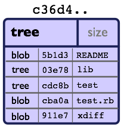

git init diyerek yeni bir repository oluşturduğumuzda, .git klasörü oluşturulur. .git klasörünün içeriğine baktığımızda aşağıdaki gibidir.


### config

Ana git konfigürasyon dosyasıdır. Proje dosyası içerisinde yer aldığı için en çok öneme sahip olan konfigürasyon dosyasıdır.

```
cat .git/config
```

```
[core]
	repositoryformatversion = 0
	filemode = false
	bare = false
	logallrefupdates = true
	symlinks = false
	ignorecase = true
```

### description

Description, dosyası GitWeb programı tarafından kullanılır, bu noktada pek önemli olduğu söylenemez.

```
cat .git/description
Unnamed repository; edit this file 'description' to name the repository.
```


### HEAD

HEAD, git repository'sinin mevcut geçerli HEAD bilgisinin referansını içerir. 
`init.defaultBranch` config değeri ile varsayılan olarak belirlediğimiz branch adı üzerinden, refs/heads/master veya refs/heads/main ya da ayarladığınız başka bir dosyaya referans oluşturur. 

```
cat .git/HEAD

ref: refs/heads/main
```

HEAD dosyası, init durumunda, refs/heads klasörüne ve şu anda mevcut olmayan main adlı bir dosyaya işaret ediyor. Bu main dosyası, repo üzerinde ilk işlemimizi yaptıktan sonra oluşturulur.

Repomuza bir dosya ekleyip ilk commitimizi oluşturduktan sonra bakarsak eğer;

```
cat .git/refs/heads/main

ae9859f87ddcddc158d90771cc3da84fc4d6265a
```

Burada bilmemiz gereken; HEAD dosyasının içeriği, yani referans olarak gösterdiği HEAD bilgisi mevcut branch'e göre değişir.


> Üstteki örnek üzerinden bakarsak eğer, main branch'ında iken `refs/heads/main` olan içerik sample-feature ismindeki branch'e geçiş yaptığımızda `refs/heads/sample-feature` olarak değişti. (Dosyaların içeriklerinin aynı olduğunu görüyoruz, bunun sebebi iki branch'inde şu anda eşit olmasıdır)


### hooks

git üzerinde bir şey olmadan önce/sonra tetikleyebileceğimiz çalıştırılabilir scriptler içeren dosyalar burada yer alır. hooks başlığında ayrıca bahsederiz.


### info

Repository hakkında ek bilgiler bu dizine kaydedilir. 

### objects

Bu dizinde, Git objelerimizin verileri saklanır - şimdiye kadar commitlediğimiz dosyaların tüm içeriği, commitler, branchler ve tag objeleri burada saklanır. Repositoryimizi ilk initialize ettiğimizde, içerisinde herhangi bir commit objesi bulunmaz sadece içleri boş info ve pack dizinleri vardır.

hash-object ile verilen içeriği hashleyip, `-w` option'ı ile local git object store'umuza eklemesini, `--stdin` ile de standart input'tan almasını söyledik.

```
echo 'test content' | git hash-object -w --stdin

d670460b4b4aece5915caf5c68d12f560a9fe3e4
```

Yukarıdaki komutun çıktısı 40 karakterlik bir checksum değeridir. Bu değer, depoladığımız içeriğin SHA-1 hash'i ile header bilgilerinin toplamıdır.

Şimdi baktığımızda ise;


Oluşan hash'in ilk 2 karakteri klasör adı, geri kalan 38 karakter ise dosya adı olacak şekilde parçalanarak objects klasörü altında depolandığını görebiliriz.

```
find .git/objects -type f

.git/objects/d6/70460b4b4aece5915caf5c68d12f560a9fe3e4
```

objects klasörümüzdeki dosya içeriğin, `cat-file` ile çözebiliriz.

```
git cat-file -p d670460b4b4aece5915caf5c68d12f560a9fe3e4

test content
```

Şimdi, içerisinde sample echo text yazan echo.txt isminde reel bir dosya ekleyip, ilk commitimizi yapalım.


Yeni klasörler geldiğini görebiliyoruz.

```
find .git/objects -type f

.git/objects/20/72da073d06b72706ac9349d21194d63caa45b8
.git/objects/27/35fc50beb86f3340dbd6fc365643d68b8d44e3
.git/objects/ae/9859f87ddcddc158d90771cc3da84fc4d6265a
.git/objects/d6/70460b4b4aece5915caf5c68d12f560a9fe3e4
```

`cat-file -p` ile bu dosyaların önce içeriklerine bakalım.

```
git cat-file -p 2072da073d06b72706ac9349d21194d63caa45b8

sample echo text
```

```
git cat-file -p 2735fc50beb86f3340dbd6fc365643d68b8d44e3

100644 blob 2072da073d06b72706ac9349d21194d63caa45b8	echo.txt
```

```
git cat-file -p ae9859f87ddcddc158d90771cc3da84fc4d6265a

tree 2735fc50beb86f3340dbd6fc365643d68b8d44e3
author kursad.koc <kursad.koc@tarimorman.gov.tr> 1744282988 +0300
committer kursad.koc <kursad.koc@tarimorman.gov.tr> 1744282988 +0300

first commit
```


sonrasında ise `cat-file -t` ile bu dosyaların  tiplerine bakalım.

```
git cat-file -t 2072da073d06b72706ac9349d21194d63caa45b8
blob

git cat-file -t 2735fc50beb86f3340dbd6fc365643d68b8d44e3
tree

git cat-file -t ae9859f87ddcddc158d90771cc3da84fc4d6265a
commit

```

Burada karşımıza git üzerindeki önemli objeler çıkıyor.

#### Blobs

Binary Large Object. Dosyaların içerikleri blob olarak saklanır. Dosya gibi düşünülebilir ancak dosyalar oluşturulma tarihi, güncelleme tarihi gibi metadatalar da içerirken, bloblar sadece dosyaların içeriğini saklar.


#### Tree

Tree, blob'lara ve diğer alt tree'lere o nesnelerin hash değerleri üzerinden referans veren klasör benzeri bir git nesnesidir.




#### Commit


### refs

Referanslar bu dizinin alt dizinlerinde saklanır. Repository'imizi ilk initialize ettiğimizde heads ve tags klasörleri bulunur. Sonrasında mesela remote repository ile eşlersek remotes klasörü eklenir.