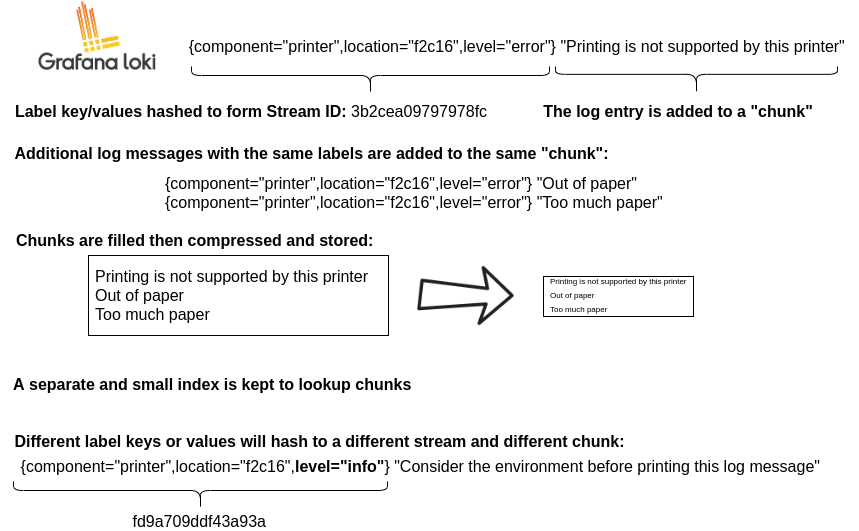

### Giriş

Grafana Loki, Prometheus'tan esinlenerek geliştirilen(metrikler yerine loglara odaklanan) ölçeklenebilir, çoklu client desteği sunan, **log verilerini toplamak, depolamak ve sorgulamak için kullanılan açık kaynak bir log toplama platformudur**. Prometheus’un aksine logları çeşitli frekanslarda pull etmek yerine kendisine push edilmesini bekler.

Loki, yalnızca loglara ait labelların metadatalarını indeksleme fikri üzerine kurulmuştur. Log verisinin kendisi daha sonra sıkıştırılır ve local dosya sisteminde ya da Amazon Simple Storage Service (S3) veya Google Cloud Storage (GCS) gibi object storage'larda **chunk** olarak isimlendirelen parçalar halinde saklanır.

Loki'de labellar çok önemli yere sahiptir. Bir log streami, aynı labelları kullanan bir log kümesidir. Labellardaki her key ve value kombinasyonu bir stream tanımlar. Sadece bir label değeri değişirse, bu yeni bir stream oluşturur. Labellar, Loki'nin veri deponuzda bir log stream’ini bulmasına yardımcı olur, bu nedenle ayırt edici bir label grubuna sahip olmak verimli sorgu yürütme konusunda çok önemlidir.

Bu örnek üzerinden incelediğimizde, ilk olarak component=printer, location=f2c16 ve level=error şeklindeki key-value çiftleri label olarak log kaydında bulunmaktadır. Log'un esas içeriği ise, *Printing is not supported by this printer* ifadesidir. Bu ifade sıkıştırılarak bu label grubu için olan chunk'a eklenir.

Labellardaki key/value değeri hashlenerek, bir sayı elde edilir. Bu sayı, bu label seti için ayırt edici bir özelliktir. Bu label seti ile tamamen aynı değerleri içeren yeni log'lar geldiğinde, label setini temsilen aynı hash değeri üretileceği için, log içerikleri önceki log'un saklandığı chunk'a ilave edilir.

Client sistemden, component=printer, location=f2c16 ve level=info şeklinde bir log geldiğinde, labellar üzerinden üretilen hash değeri farklı olduğundan yeni bir stream ve yeni bir chunk oluşturulur.

**Loki verileri nasıl saklar?**

Loki verileri saklarken iki ana dosya tipi kullanır.

- index
- chunk

Index, labellar üzerinden esas log içeriğine nasıl erişebileceğimizi gösteren işaretçilerdir. Chunk, ise belirli bir label kümesi için gruplanmış logları tutan esas depodur. 

Index dosyası için kullanılan iki farklı format vardır. Bunlar;
- TSDB
- BoltDB
formatlarıdır.

TSDB; Prometheus'un da metricleri saklarken kullandığı Time Series Database olarak bilinen formattır. Loki tarafından şu anda kullanılan format TSDB formatıdır ve Loki'deki yeni depolama özellikleri yalnızca TSDB kullanıldığında kullanılabilir. BoltDB bu açıdan eski versiyonlarla uyumluluk için bulunmaktadır.

Loki, tüm verilerini Amazon S3, Google Cloud Storage, Azure Blob Storage gibi bir object storage üzerinde saklar. Burada verileri aktarırken, index shipper ya da shipper olarak adı verilen bir adaptör kullanarak, index (TSDB veya BoltDB) dosyalarını da chunk dosyalarını sakladığı aynı object storage üzerinde tutar.

### Architecture

Grafana Loki, microservice tabanlı bir mimariye sahiptir ve yatay olarak ölçeklenebilir, dağıtılmış bir sistem olarak çalışacak şekilde tasarlanmıştır. Sistem, ayrı ayrı ve paralel olarak çalışabilen birden fazla component'e sahiptir. Tüm component'leri içeren ana bir binary bulunur ve bu binary'nin hangi component gibi çalışacağı `-target` flag'i ile belirtilir.

#### Write Path

- Distributor, stream ve log satırlarını içeren bir HTTP POST isteği alır.
- Distributor, requestte yer alan stream'i hashler, böylece hash ring’den gelen bilgilere dayanarak gönderilmesi gereken ingester örneğini belirler.
- Distributor, stream’i uygun ingester'a ve varsa replikalarına gönderir.
- Ingester, stream ve log satırlarını alır. Hashlenmiş labellarına göre ya yeni bir chunk oluşturur ya da var olan bir chunk’a ekler.
- Ingester, yazma işlemini yaptığını bildirir.
- Bu sırada distributor, ingesterlardan yazma onaylarını bekler.
- Distributor, yazma işleminin sonucuna göre 2xx, 4xx, 5xx’li bir status code döner.

#### Read Path

- Query Frontend, LogQL syntax’ında bir HTTP GET requesti alır.
- Query Frontend, query’i subquery’lere bölerek query scheduler’a gönderir.
- Querier, query scheduler üzerinden subquery’leri çeker
- Querier, queryleri bütün ingester’lara gönderir.
- Ingester üzerinde in memory olarak varsa data döndürülür.
- Querier , verileri store’dan yükler ve ingesters hiç veri döndürmezse veya yetersiz veri döndürürse sorguyu buna karşı çalıştırır.
- Querier alınan verileri tekilleştirir ve Query Frontend’e yollar
- Query Frontend, bir sorgunun tüm alt sorgularının tamamlanmasını ve Querier’lar tarafından döndürülmesini bekler.
- Query Frontend, gelen subquery sonuçlarını nihai bir sonuçta birleştirir ve client’a döndürür.

### Components

#### Distributor

Client’lardan gelen push requestlerini işlemekle sorumludur ve bu sebeple log yazım sürecindeki ilk adımdır. Gelen stream öncelikle doğrulanır ve doğrulanmış her stream replication factor adeti olarak belirlenmiş sayıdaki ingester’a gönderilir. 

Distributor, hangi stream'i hangi ingester'a göndereceğini consistent hashing kullanarak belirler. Distributor’a gelen stream verisindeki label’lar hashlenerek bir hash değer üretilir. Distributor, consistent hashing kullanarak, bu değer üzerinden hash’e karşılık gelen ring üzerindeki hangi ingester’a yönlendireceğini belirler. Bu sayede bir disributed hash table oluşmuş olur.
##### Validation

Distributor’un ilk adımı olan validation adımında, gelen tüm verilerin spesifikasyonlara uygunluğu kontrol edilir. Bu kontrol sırasında,

- Label’ların geçerli olup olmadığı
- Zaman damgalarının çok eski veya çok yeni olup olmadığı
- Log satırlarının çok uzun olmaması

gibi durumlar kontrol edilir.

##### Preprocessing

Gelen label bilgileri normalizasyona tabi tutulur. Örnek olarak, `{foo="bar", bazz="buzz"}` ifadesi ile `{bazz="buzz", foo="bar"}` ifadesinin gönderim sıralaması farklı olsa da aslında eşdeğerdir. Burada, label’lar sıralanır bu sayede önbelleklenme ve hashleme süreci daha düzgün çalışır.

##### Rate Limiting

Distributor ayrıca tenant başına maksimum veri alım hızına göre gelen logları rate limite tabi bırakabilir.
##### Forwarding

Distributor tüm validation görevlerini yerine getirdikten sonra, yazma işlemini onaylamaktan nihai olarak sorumlu olan ingester bileşenine iletir. 

Tek bir ingester kullanılılıyorsa, oluşan bir sorundan ötürü veri kaybı olabilir. Bu sebeple, distributor replication factor adeti kadar ingester'a gönderim yapar. replication_factor genellikle 3 olarak belirlenir. 3 factor için, floor(replication_factor/2) + 1 hesabı yapılarak 2 başarılı ingester yazımı beklenir. İkiden az yazma işlemi başarılı olursa, distributor bir hata döndürür ve yazma işlemi yeniden denenir.

Replication factor, yazma işlemlerinde hata olması durumunda veri kaybını önlemenin yanında bir ingester'ın yeniden başlatılması gibi durumlarda yazma işleminin duraksamadan devam etmesini de sağlar.

#### Ingester

Ingester, log yazım sürecinde, logların saklanarak ana depolama aracına (Amazon Simple Storage Service, Google Cloud Storage, Azure Blob Storage, vb.) gönderilmesinden sorumludur. Loglar okunurken ise, yakın zamanda alınmış ve henüz in memory olarak tutulan verilerinin döndürülmesinden sorumludur.

Ingester'lar, hash halkasındaki bir ingesterın yaşam döngüsünü yöneten bir lifecycler içerir.

- **Pending**; Leaving durumunda olan bir ingester, yeni bir ingester ile handoff için bekler. Handoff, ayrılan ingester'ın sahip olduğu tüm token'ları ve bellek içi parçaları yeni ingester'a aktarma işlemidir. Handoff süreci için bekleyen ingerster pending state’indedir.
- **Joining**, bir Ingester'ın tokenlarını ring üzerine yerleştirdiği ve kendisini başlattığı durumdur. Bu state’de yazma istekleri almaya başlayabilir.
- **Active**, ingester tamamıyla hazırdır. Okuma ve yazma istekleri alabilir.
- **Leaving**, bir Ingester'ın kapanırkenki durumudur. Hala bellekte bulunan veriler için okuma istekleri alabilir.
- **Unhealthy**, ingester hata durumundadır.

Bir ingester'ın aldığı her bir log stream'i, bellekte çok sayıda "chunk" oluşturur ve parametre olarak belirlenen bir değer aralığında ana depolama aracına gönderilir.

Chunk'lar sıkıştırılır ve bazı koşullar gerçekleştiğinde artık read-only olarak işaretlenirler. Bu durumlar;
- Chunk için belirlenen kapasite dolduğunda(konfigürasyon ile belirlenebilir)
- Bir süredir bu chunk'a yeni bir log verisi gelmedikçe
- Flush tetiklenirse

Bir chunk sıkıştırılıp, read-only olarak işaretlendiğinde, yazılabilir bir chunk onun yerini alır.

#### Query Frontend

Query Frontend, Querier ’daki api endpointlerini sağlayan opsiyonel bir componenttir. Eğer mevcutsa, sorgu istekleri Querier yerine Query Frontend’e yönlendirilir. Ancak bu durum Querier servisini gereksiz kılmaz. Querier, gerçek sorguları yürütmek için cluster içinde hala gerekli olacaktır.

Harici bir query scheduler componenti kullanmadığımız durumlarda, Query frontend gelen query'leri tutmak üzere basit ölçekte bir kuyruk mekanizması da sağlar. Bu senaryoda, querier’lar sorguları kuyruktan alan ve çalıştırdıktan sonra  sonuçları query frontend’e gönderen worker’lar gibi çalışır. Loki, yapılandırılırken querier'ların querier frontend'e erişebilmesi için `-querier.frontend-address` ile belirtilmesi gerekir.

Bu kuyruk üzerindeki, büyük requestlerin tüm querier’lara dağıtılarak, tek bir querier üzerinden fazla yük toplanmasını önleyin.

Query Frontend, büyük sorguları birden fazla küçük sorguya böler, bu sorgular arka taraftaki Querier’lar üzerinde paralel olarak yürütür ve sonuçları tekrar bir araya getirir. Bu da yine, tek querier üzerine gelen büyük requestten ötürü oluşabilecek out-of-memory sorunlarının oluşmasını önler ve hız kazandırır.

Ayrıca query frontend, metrik sorgu sonuçları, index istatistikleri ve log boyutu ile ilgili sorgu sonuçlarının cache’e alınmasını destekler ve bunları sonraki sorgularda yeniden kullanır.

#### Query Scheduler

Her ne kadar query frontend dahili bir queue mekanizması sunsa da daha gelişmiş işlevsellik için query scheduler servisi kullanılır. Opsiyonel bir componenttier ancak üstteki sebepten ötürü kullanımı tavsiye edilir.

Query Scheduler kullandığımız senaryoda artık Query Frontend bölümlediği sorguları dahili olarak queue üzerinde saklayan query scheduler’a gönderir. Query scheduler’a bağlanan querier’ler, işlerini queue üzerinden alan, query’leri çalıştıran ve toplama için query frontend’ine döndüren worker’lar olarak hareket ederler. Bu nedenle querier'ların, query scheduler'a bağlanabilmeleri için query scheduler'ın `-querier.scheduler-address` ile konfigüre edilmesi gerekir.

#### Querier

Querier; LogQL query’lerinin çalıştırılmasından sorumludur. Client’dan gelen HTTP isteklerini doğrudan işler(single binary veya simple scalable deployment mode’unda) veya query frontend/query scheduler üzerinden subquery olarak çeker.

Log datalarını, ingester’lardan veya long-term storage’dan getirir. Ana storage üzerinden sorgulama yapmadan önce, bütün ingestar’lardaki in-memory veri sorgulanır. Replication factor sebebiyle, ingesterlar üzerinden aynı veriler getirilebilir, bu veriler timestamp, label ve log mesajı kontrol edilerek tekilleştirilir.

#### Index Gateway

#### Compactor

Compactor servisi, ingester tarafından object storage’a gönderilen index dosyalarını sıkıştırmak için kullanılır. Compactor bunu yaparken, dosyaları düzenli aralıklarla object storage üzerinden indirir, tek bir dosyada birleştirir, yeni oluşturulan index’i yükler ve eski dosyaları temizler.

Compactor, ayrıca log retention ve log deletion işlemlerinden sorumludur.
#### Ruler

Ruler servisi, bir rule configuration’ı sağlanan kural ve/veya uyarıları kontrol eder ve yönetir. Rule configuration object storage üzerinde (veya alternatif olarak yerel dosya sisteminde) saklanır ve ruler API'si aracılığıyla veya doğrudan dosyalar object storage alanına yüklenerek yönetilebilir.

### Deployment Modes

Loki pek çok componentten oluşan modüler bir yapı sunar. Bu componentlerin hepsi bir arada çalıştırılabilirken, sahiplendiği görevlere göre mantıksal olarak gruplandırılıp da çalıştırılabilir.

#### Monolithic Mode

En basit çalışma modu monolithic moddur. Monolitik modu `-target=all` komut satırı parametresini ayarlayarak etkinleştirirsiniz. Bu modda, Loki'nin tüm microservice bileşenlerini tek bir binary veya Docker container’ı olarak tek bir process içinde çalıştırır. 

Monolithic mod, Loki'yi denemeye hızlı bir şekilde başlamanın yanı sıra günde yaklaşık 20 GB'a kadar olan küçük okuma/yazma hacimleri için kullanışlıdır.