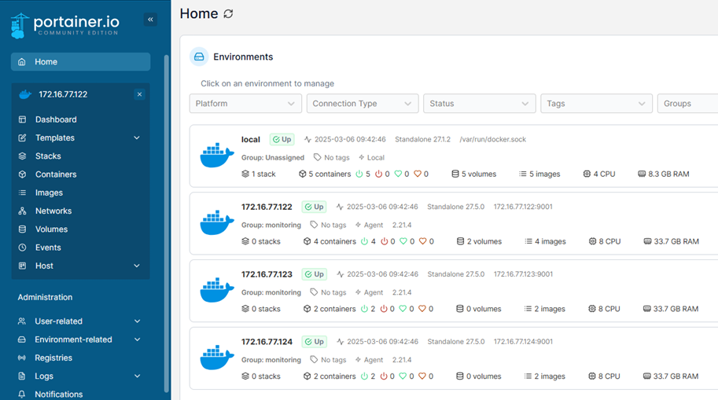
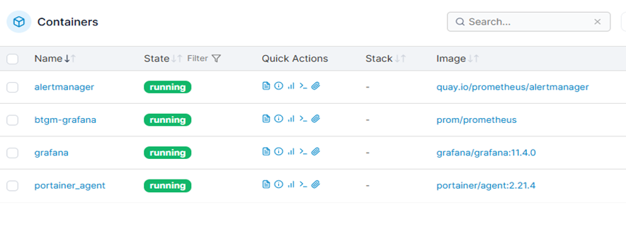
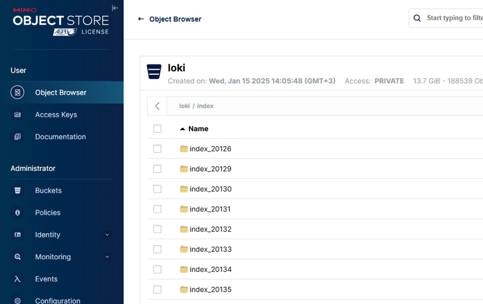
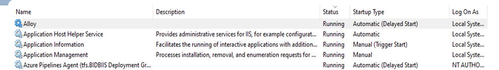
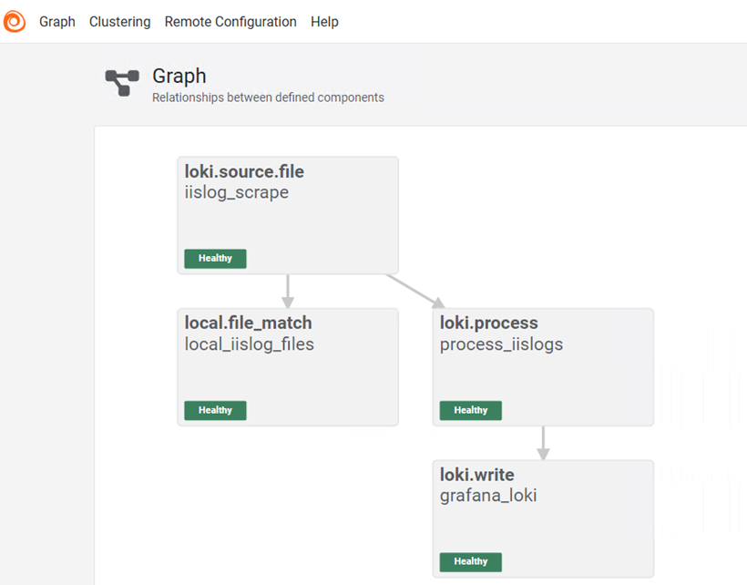
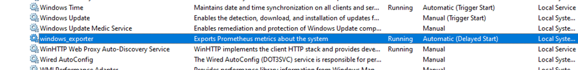
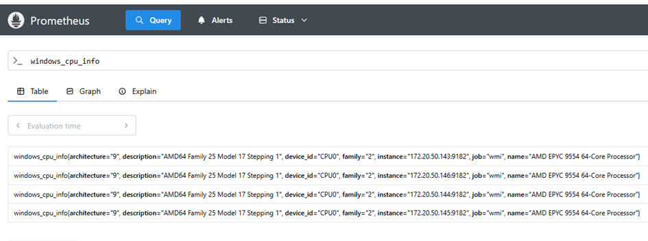
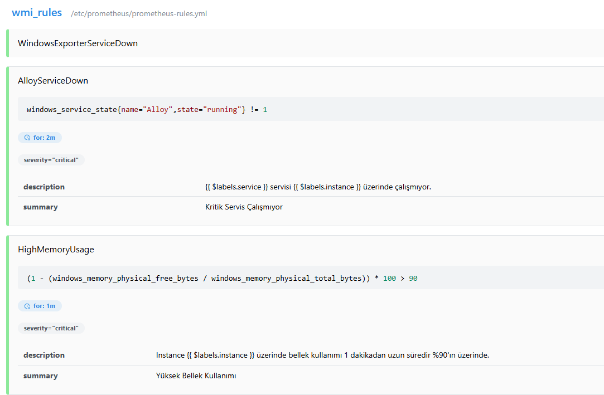
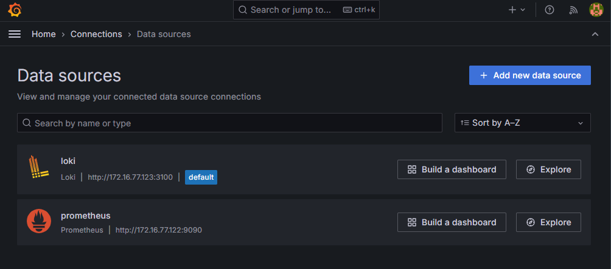
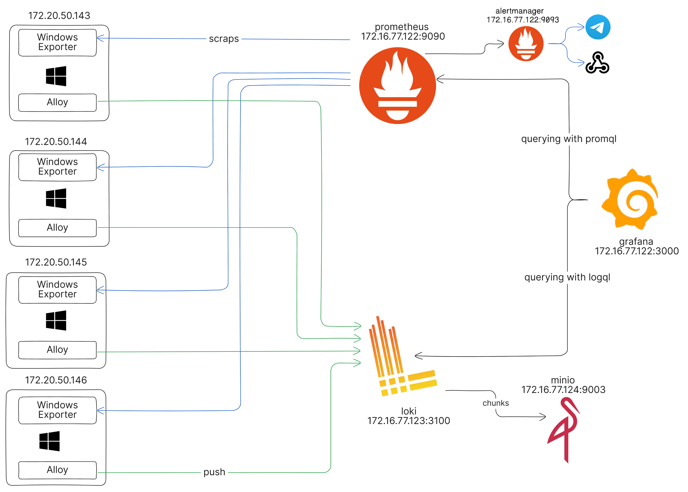

### Portainer

Portainer, terminal üzerinden yönettiğimiz Docker nesnelerini, bir web arayüzünden yönetebilmemizi sağlayan bir yönetim aracıdır. Birden fazla host’u tek bir arayüzden takip edebildiğimiz için sunucuları ayrı ayrı kontrol etmeye gerek kalmamaktadır.

Biz de sunucularımızda, docker üzerinden çalıştırdığımız uygulamaların takibini yapılabilmek için kullanıyoruz.

[https://172.16.75.90:9443/](https://172.16.75.90:9443/) url’i üzerinden erişebiliriz.

Username : admin

Password: PortainerPa++w0rd



Portainer agent kurduğumuz bütün sunucuları takip edebiliriz.



Container detayı üzerinden, container’ları durdurma, yeniden başlatma, inspect, log takibi, attach, exec gibi yönetimsel işlemler yapılabilir. Ayrıca çalışan container’ın volume, environment, port gibi bilgileri izlenebilir.

### Minio
Minio, açık kaynak kodlu bir nesne depolama sistemidir. Amazon S3 protokolü ile uyumlu olarak çalışabilmektedir.



Biz de Loki’ye aktardığımız IIS loglarımızı depolamak için arka planda Minio kullanıyoruz. Minio’nun web arayüzüne [http://172.16.77.124:9004/](http://172.16.77.124:9004/) url’i üzerinden erişebiliriz.

Username : admin

Password: MinioPa++w0rd

### Alloy

Alloy, çeşitli kaynaklardan topladığı veriler üzerinde, filtreleme, transformasyon gibi çeşitli işlemler yaptıktan sonra, veriyi belirtilen kaynaklara yazabilen open-telemetry uyumlu bir veri toplama aracıdır.

Biz  uygulama sunucularında, log tailing yaparak toplanan IIS loglarını, log toplama aracımız Loki’ye gönderebilmek için Alloy kullanıyoruz. Bu işlem için, her sunucu üzerinde, Windows service olarak çalışan bir Alloy instance’ı mevcuttur.



Servisin çalıştırdığı exe dosyası çalışırken arka planda, C:\Program Files\GrafanaLabs\Alloy\config.alloy path’indeki config dosyasını kullanarak işlem yapar.

```
logging {
	level = "info"
}

local.file_match "local_iislog_files" {
    path_targets = [{"__path__" = "E:/IISLOG/**/*.log"}]
    sync_period = "5s"
	ignore_older_than = "10s"
}

loki.source.file "iislog_scrape" {
    targets    = local.file_match.local_iislog_files.targets
    forward_to = [loki.process.process_iislogs.receiver]
}
  
loki.process "process_iislogs" {

    stage.drop {
        expression = "^#"
        drop_counter_reason = "comment lines"
    }
	
	stage.replace {
		expression = "(\\r+)"
		replace    = ""
	}
   
    stage.regex {
        expression = `^(?P<date>[^ ]*) (?P<time>[^ ]*) (?P<site>[^ ]*) (?P<computer>[^ ]*) (?P<serverip>[^ ]*) (?P<method>[^ ]*) (?P<path>[^ ]*) (?P<query>[^ ]*) (?P<port>[^ ]*) (?P<username>[^ ]*) (?P<ip>[^ ]*) (?P<agent>[^ ]*) (?P<referer>[^ ]*) (?P<host>[^ ]*) (?P<status>[^ ]*) (?P<substatus>[^ ]*) (?P<win32_status>[^ ]*) (?P<request_bytes>[^ ]*) (?P<response_bytes>[^ ]*) (?P<duration>\d+) (?P<originalip>[^ ]*)\r?$`
    } 
   
    stage.static_labels {
      values = {
        service_name = "iislogs",
      }
    }

    stage.template {
		source = "timestamp"
		template = "{{ .date }}T{{ .time }}.000Z"
    }
	
	stage.timestamp {
        source = "timestamp"
        format = "2006-01-02T15:04:05.000Z"
    }
	
	 stage.labels {
        values = {
            host = "host",
            computer = "computer",
        }
    }
	
	stage.label_drop {
		values = [ "filename" ]
	}
	

    forward_to = [loki.write.grafana_loki.receiver]
}

loki.write "grafana_loki" {
    endpoint {
        url = "http://172.16.77.123:3100/loki/api/v1/push"
    }
}

```

Halihazırda biz; E:/IISLOG path’i altındaki, bütün .log uzantılı dosyaları takip edip, tailing işlemi yapıyoruz ve elde edilen logları [http://172.16.77.123:3100/loki/api/v1/push](http://172.16.77.123:3100/loki/api/v1/push) adresindeki loki endpointine gönderiyoruz.

Her sunucu üzerinde `localhost:12345` adresi üzerinden alloy’un çalıştırdığı componentler ve tanımlarını gösteren web arayüzüne erişebiliriz.




### Loki

Grafana Loki, Prometheus'tan esinlenerek geliştirilen ölçeklenebilir, çoklu client desteği sunan, log verilerini toplamak, depolamak ve sorgulamak için kullanılan açık kaynak bir log toplama aracıdır.

Loki, metrikler yerine loglara odaklanır. Prometheus’un aksine logları çeşitli frekanslarda pull etmek yerine kendisine push edilmesini bekler. Loki’nin diğer log sistemlerden ana yaklaşım farklı, logların içerikleri yerine loglara ait metadata’ları indekslemesidir.

Grafana ile sorunsuz bir şekilde entegre olarak, log kayıtları üzerinde sorgulama  ve çeşitli görselleştirme çalışmaları yapılabilir.

Loki uygulaması, 172.16.77.123:3100 adresi üzerinden hizmet veriyor şu anda.

Bir takım dahili endpoint yardımıyla, uygulamanın sağlık durumu kontrol edilebilir.

Örneğin;

- [http://172.16.77.123:3100/ready](http://172.16.77.123:3100/ready)  endpoint’i üzerinden genel servis durumuna
- [http://172.16.77.123:3100/services](http://172.16.77.123:3100/services) endpoint’i üzerinden dahili componentlerin durumuna
- [http://172.16.77.123:3100/config](http://172.16.77.123:3100/config) endpoint’i üzerinden mevcut konfigürasyon bilgilerine
- [http://172.16.77.123:3100/loki/api/v1/labels](http://172.16.77.123:3100/loki/api/v1/labels)
- [http://172.16.77.123:3100/metrics](http://172.16.77.123:3100/metrics)
- [http://172.16.77.123:3100/loki/api/v1/status/buildinfo](http://172.16.77.123:3100/loki/api/v1/status/buildinfo)
- http://172.16.77.123:3100/log_level
- http://172.16.77.123:3100/loki/api/v1/label/service_name/values
- http://172.16.77.123:3100/loki/api/v1/series
- http://172.16.77.123:3100/distributor/ring


bakılabilir.

```
/etc/loki/loki-config.yml
```

```
auth_enabled: false

server:
  http_listen_port: 3100
  grpc_listen_port: 9096

common:
  replication_factor: 1
  path_prefix: /loki
  ring:
    instance_addr: 127.0.0.1
    kvstore:
      store: inmemory

schema_config:
  configs:
    - from: 2020-05-15
      store: tsdb
      object_store: s3
      schema: v13
      index:
        prefix: index_
        period: 24h

storage_config:
  use_thanos_objstore: true
  object_store:
    s3:
      endpoint: 172.16.77.124:9003
      bucket_name: lokiv2
      access_key_id: FMWC8WS0Dyeh1zP5HS4d
      secret_access_key: T0Kdvqsar5oKvO6w5mdxNjSNSmImXmcaQ2Bs4iqo
      insecure: true

limits_config:
  ingestion_rate_mb: 20
  ingestion_burst_size_mb: 30


frontend:
  encoding: protobuf
```

### Prometheus

Prometheus, Go dili ile geliştirilmiş, açık kaynak bir metrics-based monitoring ve alerting sistemidir. Kubernetes’ten sonra ikinci CNCF üyesidir 9 Ağustos 2018’den tarihinden beri “graduated project” olarak değerlendirilmektedir.

Prometheus metrik verilerini, time-series olarak toplar ve saklar. Metrik verisi, bir zaman damgası ve metrik verisini tanımlayan key-value çiftleri şeklinde isteğe bağlı labellardan oluşur. Metrik verilerini time-series olarak saklamak, bu değerin zaman içerisindeki değişimini takip edebilmemize olanak sağlamaktadır.

Uygulama sunucularını üzerindeki metrik değerlerini takip edebilmek için Prometheus kullanıyoruz. Sunuculara kurduğumuz “windows_ exporter” prometheus için Windows metriclerini export eden bir agent gibi çalışır.



C:\Program Files\windows_exporter\windows_exporter.exe" --config.file="C:\Program Files\windows_exporter\config.yaml" --collectors.enabled cpu,logical_disk,logon,memory,net,os,physical_disk,service,system,iis,cpu_info,tcp

Windows Exporter çalıştığında, default olarak `9182` portu üzerinde bir web server ayağa kaldırır. Prometheus bu server üzerindeki `/metrics` endpointi üzerinden metric verileri sürekli olarak toplar. 

- 172.20.50.143:9182
- 172.20.50.144:9182
- 172.20.50.145:9182
- 172.20.50.146:9182

[http://172.16.77.122:9090/](http://172.16.77.122:9090/) url’i üzerinden web arayüzüne erişilebilir.



`/etc/prometheus/prometheus.yml` path'i üzerinden çalışan prometheus instance'ının config bilgilerine bakabiliriz.

```
global:
  scrape_interval: 15s

rule_files:
  - "prometheus-rules.yml"

scrape_configs:
  - job_name: 'prometheus'
    static_configs:
      - targets: ['localhost:9090']

  - job_name: 'wmi'
    static_configs:
        - targets:
          - '172.20.50.143:9182'
          - '172.20.50.144:9182'
          - '172.20.50.145:9182'
          - '172.20.50.146:9182'

alerting:
  alertmanagers:
    - scheme: http
      static_configs:
        - targets: [ 'alertmanager:9093' ]
```

Burada çalışan prometheus container'i üzerinde `/etc/prometheus/prometheus-rules.yml` path'inde bir rule tanım dosyası oluşturduk. 

```
groups:
  - name: custom_rules
    rules:
      - record: windows_memory_physical_free_percent
        expr: 100 - 100 * windows_memory_physical_free_bytes / windows_memory_physical_total_bytes
  - name: wmi_rules
    rules:
    
      - alert: WindowsExporterServiceDown
        expr: windows_service_state{name="Themes",state="running"} != 1
        for: 2m
        labels:
          severity: critical
        annotations:
          summary: "Kritik Servis Çalışmıyor"
          description: "{{ $labels.service }} servisi {{ $labels.instance }} üzerinde çalışmıyor."
          
      - alert: AlloyServiceDown
        expr: windows_service_state{name="Alloy",state="running"} != 1
        for: 2m
        labels:
          severity: critical
        annotations:
          summary: "Kritik Servis Çalışmıyor"
          description: "{{ $labels.service }} servisi {{ $labels.instance }} üzerinde çalışmıyor."
          
      - alert: HighMemoryUsage
        expr: (1 - (windows_memory_physical_free_bytes / windows_memory_physical_total_bytes)) * 100 > 90
        for: 1m
        labels:
          severity: critical
        annotations:
          summary: "Yüksek Bellek Kullanımı"
          description: "Instance {{ $labels.instance }} üzerinde bellek kullanımı 1 dakikadan uzun süredir %90'ın üzerinde."
          
      - alert: HighCPUUsage
        expr: 100 - (avg by (instance) (irate(windows_cpu_time_total{mode="idle"}[2m])) * 100) > 80
        for: 1m
        labels:
          severity: warning
        annotations:
          summary: "Yüksek CPU Kullanımı"
          description: "Instance {{ $labels.instance }} üzerindeki CPU kullanımı 1 dakikadan uzun süredir %80'in üzerinde."
          
      - alert: ServerRestarted
        expr: windows_system_boot_time_timestamp_seconds < 100
        for: 1m
        labels:
          severity: info
        annotations:
          summary: "Sunucu Yeniden Başlatıldı"
          description: "Instance {{ $labels.instance }} yeniden başlatıldı."
```



### Alertmanager

```
route:
  group_wait: 5s
  receiver: 'telegram'

receivers:
  - name: 'webhook'
    webhook_configs:
      - url: 'https://webhook.site/fd7793d7-1bee-4578-9e37-2433b2554bec'
        send_resolved: false

  - name: 'telegram'
    telegram_configs:
      - bot_token: '7650407753:AAHcxzYS5yZGDLTM0vdDoshri8c94tUTRHQ'
        chat_id: -4739399627
```

### Grafana

Grafana, uyumlu bir veri sağlayıcısı tarafından sağlanan verileri çeşitli metrikler, grafikler veya sağlanan veri tiplerine göre görselleştirmeye yarayan çok platformlu ve açık kaynaklı web tabanlı bir uygulamadır. Grafana gözlemlenen veritabanın büyüklüğüne bağlı olarak gerçek zamanlı olarak çeşitli alarmların, değerlerin ve uyarıların kullanıcıya veya geliştiriciye kullanıcı dostu bir arayüz ile aktarmaktadır.

```
http://172.16.77.122:3000
admin
GrafanaPa++w0rd
```




### Pipeline

