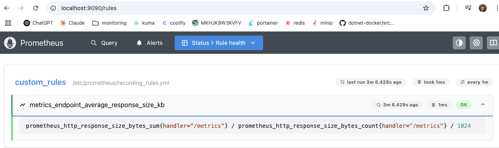
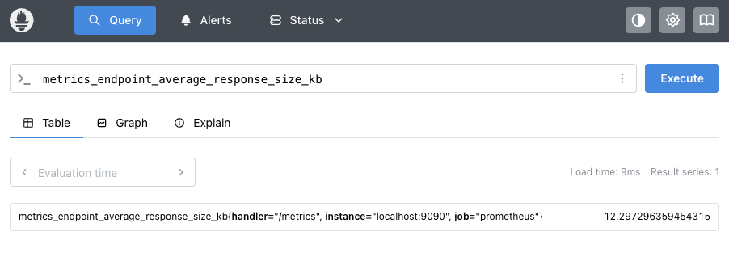
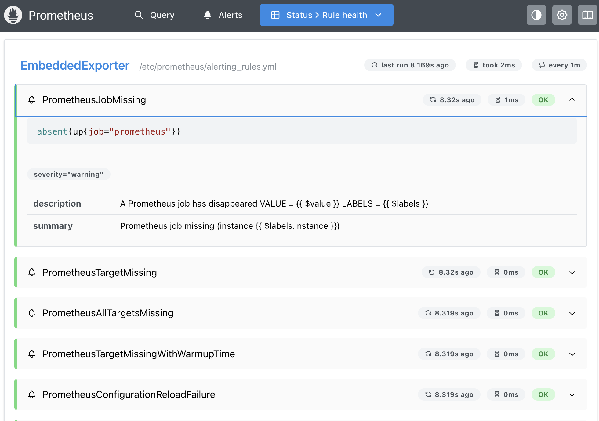
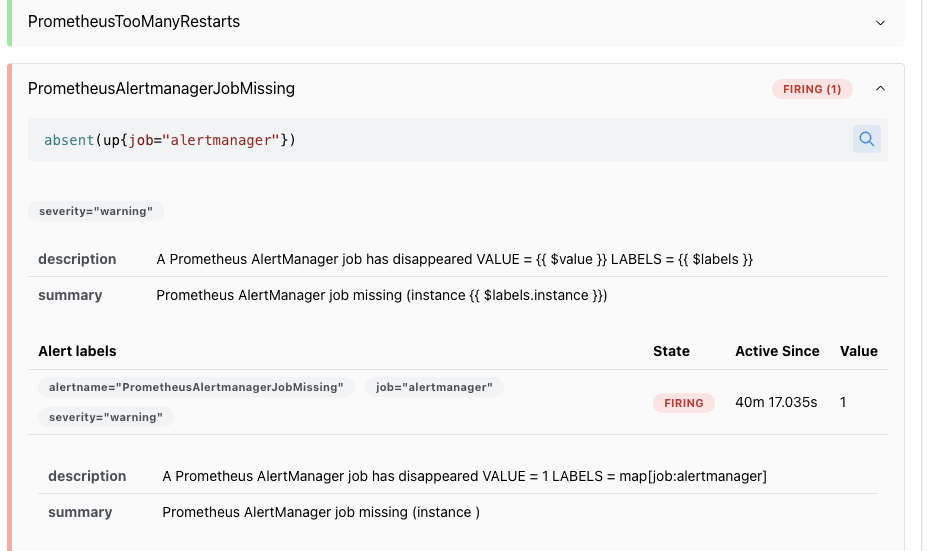

### Giriş

Prometheus, SoundCloud firması tarafından Go dili ile geliştirilmiş, açık kaynak bir metrics-based monitoring ve alerting sistemidir. Kubernetes’ten sonra ikinci CNCF üyesidir 9 Ağustos 2018’den tarihinden beri “graduated project” olarak değerlendirilmektedir.

Prometheus kendisine verilen metric endpointlerden, metrik verilerini scrap ederek, time-series olarak toplar ve saklar. metrik verisi, bir zaman damgası ve metrik verisini tanımlayan key-value çiftleri şeklinde isteğe bağlı labellardan oluşur. Metrik dediğimiz şey, herhangi bir sayısal ölçüm değeridir diyebiliriz. Time series demek ise, zamana karşı olan değeri ifade eder. Bu açıdan, metrik verilerini time-series olarak saklamak, bir değerin zaman içerisindeki değişimini takip edebilmemize olanak sağlamaktadır. 

Metrikler, uygulamaların neden belirli bir şekilde çalıştığını anlamada önemli bir rol oynar. Örnek olarak, yavaş çalıştığını düşündüğümüz bir uygulamanın neden yavaş çalıştığını analiz etmede anlık istek sayısı, anlık kullanıcı sayısı gibi metriclerden faydalanabiliriz.


> Prometheus metric isimleri `[a-zA-Z_:][a-zA-Z0-9_:]*` regex formatına uygun olmalı ve ölçülmek istenen değer hakkında fikir vermelidir. Örnek olarak; `http_requests_total`

> Prometheus label'ları bir metric değerinin olası cardinality'sini, olası değerlerini ifade edecek belirteçlerdir. `[a-zA-Z_][a-zA-Z0-9_]*` regex formatına uygun isimlendirilmelidir.

Örnek olarak, metric adı api_http_requests_total ve labelları method=POST ve handler="/messages" olan bir time series aşağıdaki gibidir

```
api_http_requests_total{method="POST", handler="/messages"}
```

#### Metric Tipleri

##### Counter

Counter, sürekli olarak artan tek bir sayacı temsil eden metrikler için kullanılacak tiptir. Örneğin, sunulan isteklerin, tamamlanan görevlerin veya hataların sayısını temsil etmek için counter kullanabilirsiniz.
##### Gauge

Gauge, artıp azalabilen tek bir sayısal değeri temsil eden metrikler için kullanılacak tiptir. Örneğin, anlık çalışan işlemlerin sayısı, mevcut bellek kullanımı, eşzamanlı istek sayısı gibi yukarı ve aşağı gidebilen değerler için kullanılır.
##### Histogram

Histogram metric tipi, dağılımı ölçmek için kullanılır. Özellikle latency, size veya başka ölçülebilir değerlerin frekans dağılımını anlamak için idealdir. Histogram, ölçülen değerlerin belirli aralıklara (buckets) göre kaç kere gerçekleştiğini sayar. Bu sayede, değerlerin hangi aralıklarda yoğunlaştığını görürüz ve ortalama veya p95 gibi percentile hesaplarını yapabiliriz.

Bir histogram metriği 3 tip veri grubundan

oluşur:
- bucketlar `<basename>_bucket{le="<upper inclusive bound>"}`
- `<basename>_sum` Tüm ölçümlerin toplamını gösterir
- `<basename>_count` Toplam kaç ölçüm yapıldığını gösterir.

```
http_request_duration_seconds_bucket{le="0.1"} 240
http_request_duration_seconds_bucket{le="0.5"} 500
http_request_duration_seconds_bucket{le="1"}   800
http_request_duration_seconds_bucket{le="+Inf"} 1000

http_request_duration_seconds_count 1000
http_request_duration_seconds_sum   560.34
```

##### Summary

Histogram gibi ölçümlerin dağılımını izlemek için kullanılır, ama farklı bir yaklaşımla çalışır. count ve sum bulurken, kayan bir zaman penceresi üzerinde yapılandırılabilir nicelikleri hesaplar. 

```
http_request_duration_seconds{quantile="0.5"} 0.32
http_request_duration_seconds{quantile="0.9"} 0.55
http_request_duration_seconds{quantile="0.99"} 1.2

http_request_duration_seconds_sum  1347.1
http_request_duration_seconds_count 3560

```

### Prometheus Architecture


Prometheus, kaynakları izlemek için exporter olarak adlandırılan araçları(windows exporter, node-exporter, redis-exporter vb.) kullanır. Exporterlar, izlenecek olan kaynağa ait verileri Prometheus sisteminin anlayacağı biçime çevirerek HTTP protokolü(/metrics) üzerinden sunar. Prometheus, configuration dosyası üzerinde belirtilen exporter adreslerine belirlenen aralıklarla HTTP isteği yaparak(polling) verileri TSDB'ye kaydeder. 

Kaydedilen veriler, PromQL kullanılarak Prometheus Web GUI, Grafana gibi araçlar üzerinden servis edilir.

Rule tanımları yapılırsa, konfigüre edilen bir Alertmanager aracılığıyla, anomali içeren metric değerleri üzerinden Alertmanager kullanarak belirlenen notification arayüzleri aracılğıyla alert'ler üretilebilir.

Prometheus server, 3 kısımdan oluşur.

1- Retrieval; target’lardan pull edilen verileri alır ve prometheus üzerindeki local time series db’ye yazar
2- TSDB; time series database
3- HTTP server; TSDB üzerindeki verileri diğer araçlara sunar (örneğin grafana)


### Kurulum

```
global:
  scrape_interval: 15s

scrape_configs:
  - job_name: 'prometheus'
    static_configs:
      - targets: ['localhost:9090']
```

```
docker volume create prometheus-data
docker network create monitoring
docker run -d -p 9090:9090 --name prometheus -v /etc/prometheus:/etc/prometheus -v prometheus-data:/prometheus --network monitoring prom/prometheus
```

```
docker network create monitoring
docker run -d --name prometheus -p 9090:9090 -v C:\prometheus\configs:/etc/prometheus -v C:\prometheus\data:/prometheus --network monitoring prom/prometheus
```

Docker üzerinden çalıştırdığımızda, default olarak aşağıdaki flag'lerle çalışır.

```
/bin/prometheus --config.file=/etc/prometheus/prometheus.yml --storage.tsdb.path=/prometheus
```

Örnek konfigürasyon olarak, prometheus'a sadece kendi metriclerini toplaması için localhost:9090 adresini verdik. Prometheues, 15 saniyede bir localhost:9090/metrics url'i üzerinden kendi metriclerini toplayacak.

```
 curl localhost:9090/metrics
 
# HELP go_gc_cycles_automatic_gc_cycles_total Count of completed GC cycles generated by the Go runtime. Sourced from /gc/cycles/automatic:gc-cycles.
# TYPE go_gc_cycles_automatic_gc_cycles_total counter
go_gc_cycles_automatic_gc_cycles_total 20
# HELP go_gc_cycles_forced_gc_cycles_total Count of completed GC cycles forced by the application. Sourced from /gc/cycles/forced:gc-cycles.
# TYPE go_gc_cycles_forced_gc_cycles_total counter
go_gc_cycles_forced_gc_cycles_total 0
# HELP go_gc_cycles_total_gc_cycles_total Count of all completed GC cycles. Sourced from /gc/cycles/total:gc-cycles.
# TYPE go_gc_cycles_total_gc_cycles_total counter
go_gc_cycles_total_gc_cycles_total 20
# HELP go_gc_duration_seconds A summary of the wall-time pause (stop-the-world) duration in garbage collection cycles.
# TYPE go_gc_duration_seconds summary
go_gc_duration_seconds{quantile="0"} 3.4351e-05
go_gc_duration_seconds{quantile="0.25"} 9.3308e-05
go_gc_duration_seconds{quantile="0.5"} 0.000168452
go_gc_duration_seconds{quantile="0.75"} 0.000400366
go_gc_duration_seconds{quantile="1"} 0.000647535
go_gc_duration_seconds_sum 0.004785347
go_gc_duration_seconds_count 20
```


Healthcheck olarak 
```
http://localhost:9090/-/healthy
```

Readiness check olarak da
```
http://localhost:9090/-/ready
```

endpointleri kullanılabilir.

### Configuration

Prometheus, command line flag'leri ve bir configuration dosyası aracılığıyla yapılandırılabilir. Prometheus'un çalışması ile alakalı bazı ayarlar flag'ler üzerinden yapılırken(storage lokasyonu, disk, memory kısıtları vs.), scrap ile alakalı kullanacağımız hemen her konfigürasyon(job tanımları, job intervalleri vs.) ise configuration dosyası aracılığıyla yapılabilir.

Bazı command line flag'lerine bakacak olursak eğer;

`--config-file` : Prometheus konfigürasyon dosyası path'i. Default olarak prometheus.yml

`--storage.tsdb.path` : Metric'lerin saklanacağı path. Default olarak data/

`--storage.tsdb.retention.time` : Verilerin ne kadar süreyle storage üzerinde tutulacağı. size da belirtilmemişse default değeri 15d'dir.

`--storage.tsdb.retention.size` : 

`--web.listen-address` : Prometheus UI adresi. Default olarak 0.0.0.0:9090

`--web.enable-lifecycle` : Endpoint üzerinden reload ve shutdown yapabilmeyi aktifleştirir. Default olarak false

`--web.enable-admin-api` : Bazı yönetimsel endpointler için kullanılır. Default olarak false

`--web.page-title` : UI web sayfasının title'ı. Default olarak "Prometheus Time Series Collection and Processing Server"

`--log.level` : Default info. Olası değerler debug, info, warn, error

`--log.format` : Default değeri logfmt. Olası değerler logfmt, json
 
> [!Not] 
> Bütün flag'lere ve mevcut değerlerine http://localhost:9090/api/v1/status/flags endpoint'i üzerinden bakılabilir.


Bazı http api endpointleri; https://prometheus.io/docs/prometheus/latest/querying/api/

http://localhost:9090/api/v1/status/config

http://localhost:9090/api/v1/status/flags

http://localhost:9090/api/v1/status/runtimeinfo

http://localhost:9090/api/v1/status/buildinfo

http://localhost:9090/api/v1/status/tsdb

http://localhost:9090/api/v1/status/walreplay

http://localhost:9090/api/v1/targets

http://localhost:9090/api/v1/alertmanagers

http://localhost:9090/api/v1/alerts

http://localhost:9090/api/v1/rules

http://localhost:9090/api/v1/metadata

http://localhost:9090/api/v1/targets/metadata


Örnek bir konfigürasyon dosyası oluşturursak;

```
global:
  scrape_interval: 15s

scrape_configs:
  - job_name: 'prometheus'
    static_configs:
      - targets: ['localhost:9090']

  - job_name: 'wmi'
    static_configs:
        - targets:
          - '172.20.50.143:9182'
          - '172.20.50.144:9182'
          - '172.20.50.145:9182'
          - '172.20.50.146:9182'
```

`scrape_interval` : Target'lardan ne sıklıkla scraping işlemi yapılacak. Default değeri 1m

`scrape_timeout` : Bir target’tan scraping yaparken kullanılacak timeout süresi. interval süresinden fazla olamaz doğal olarak. Default değeri 10 sn

`evaluation_interval` : Rule tanımlarımızın ne sıklıkla kontrol edileceği Default değeri 1m

`external_labels` : label_name:label_value şeklindeki label'lar

`query_log_file` : PromQL sorgularının kaydedileceği dosya

`scrape_failure_log_file` : Scraping hatalarının kaydedileceği dosya

`body_size_limit`: Scraping sonrasında gelen veri boyutu limiti. Size türünden belirtilir. Ör: 100MB . Default değeri 0'dır. Limit yoktur 

`sample_limit` : Scraping işlemi sırasında gelen sample limiti. Default değeri 0'dır. Limit yoktur

`label_limit` : Sample üzerinde belirtilen label adedi limiti. Default değeri 0'dır. Limit yoktur

`rule_files` : Burada belirtilen glob pattern'e uyan rule dosyalarından rule tanımları eklenir. 

`scrape_config_files`: Burada belirtilen glob pattern'e uyan config dosyalarından scraping tanımları eklenir.

`scrape_configs` : scrape_config tipinde scraping tanımları

#### scrape_config

`job_name`: Scraping job'ı için belirlenen isim

`scrape_interval`: Burada interval değeri verilirse global’deki değer ezilir, verilmezse default olarak global.scrape_interval değeri alınır

`scrape_timeout` : Burada timeout değeri verilirse global’deki değer ezilir, verilmezse de default olarak global.scrape_timeout değeri alınır

`metrics_path` : Metric'lerin HTTP üzerinden getirileceği path. Default değeri /metrics dir.

`schema` : Metric requestleri için hangi schema kullanılacak. Default değeri http'dir.

`http_config` : Scraping işlemi sırasında kullanılacak http client ayarları. authentication/authorization, http header, tls ayarları vs
- basic_auth : username ve password belirterek basic authentication bilgisi gönderilebilir.
- authorization : bütün request'lerde gönderilecek Authorization header'ı. type:Bearer, credentials: token bilgisi gönderilir.
- oauth2
- tls_config
- proxy_url
- http_headers

Prometheus, çalışmaya devam ederken -doğru formatta bir konfigürasyon tanımlanmışsa- konfigürasyonunu yeniden yükleyebilir. Bunu yapmanın iki yolu vardır; ilki prometheus process'ine SIGHUP göndermek veya /-/reload endpoint'ine istek atmak(`--web-enable-lifecycle` enabled edilmiş olması lazım)

```
kill -s SIGHUP <PID>
```

```
docker exec prometheus killall -HUP prometheus
```


Prometheus çalıştırılırken, `--web-enable-lifecycle` flag'i enabled olarak çalıştırılırsa; reload ve quit(graceful olarak sonlandırır prometheus'u) gibi management api endpointleri çalıştırılabilir.


### Querying

Prometheus, PromQL isminde bir sorgulama dili desteği sunar. 

### Storage

Prometheus, disk üzerinde local bir time-series veritabanı içerir, ancak isteğe bağlı olarak remote depolama sistemleriyle de entegre olabilir.


```
sudo ls /var/lib/docker/volumes/prometheus-data/_data -Al

drwxr-xr-x 3 nobody nogroup  4096 Apr 15 23:00 01JRXTWPQNK1QCXT74JAAE7R8E
drwxr-xr-x 3 nobody nogroup  4096 Apr 16 17:00 01JRZRP8TYQJXB6SPNKV7J38SY
drwxr-xr-x 3 nobody nogroup  4096 Apr 17 11:00 01JS1PFSBYMQBXYWSM9DH8QTSM
drwxr-xr-x 3 nobody nogroup  4096 Apr 18 05:00 01JS3M9BE0NY6Y86ZJNE5XTD87
drwxr-xr-x 3 nobody nogroup  4096 Apr 18 23:00 01JS5J2VR9MTTHFVSHHD17JG80
drwxr-xr-x 3 nobody nogroup  4096 Apr 19 17:00 01JS7FWDVZJHFBBH1S9YTZY0RG
drwxr-xr-x 3 nobody nogroup  4096 Apr 20 11:00 01JS9DNYBN4AYHB53R1N15CY5F
drwxr-xr-x 3 nobody nogroup  4096 Apr 21 05:00 01JSBBFGDMT22W44MXCFNQ2YC1
drwxr-xr-x 3 nobody nogroup  4096 Apr 21 23:00 01JSD990R086NK8TSVF6YHA4M0
drwxr-xr-x 3 nobody nogroup  4096 Apr 22 17:00 01JSF72JX2Q54Y1H3X0X4TJEZK
drwxr-xr-x 3 nobody nogroup  4096 Apr 23 11:00 01JSH4W3BBDXFP7XN0DGKDYNNH
drwxr-xr-x 3 nobody nogroup  4096 Apr 24 05:00 01JSK2NNCFFYBVY95GWNZXSRWA
drwxr-xr-x 3 nobody nogroup  4096 Apr 24 23:00 01JSN0F605P0JNX7XST573SEPW
drwxr-xr-x 3 nobody nogroup  4096 Apr 25 17:00 01JSPY8R5YZC7SWMZQT89M79NQ
drwxr-xr-x 3 nobody nogroup  4096 Apr 26 11:00 01JSRW289FJVC0FNN2M2D170G8
drwxr-xr-x 3 nobody nogroup  4096 Apr 27 05:00 01JSTSVTDFBH6Z0SYH58EKJ1PC
drwxr-xr-x 3 nobody nogroup  4096 Apr 27 23:00 01JSWQNARTH4SW6B9XDCBMQE0G
drwxr-xr-x 3 nobody nogroup  4096 Apr 28 17:00 01JSYNEX21DS0H20DVBG4KPBTA
drwxr-xr-x 3 nobody nogroup  4096 Apr 29 11:00 01JT0K8DBB40C01GGA7VCWJJPZ
drwxr-xr-x 3 nobody nogroup  4096 Apr 30 05:00 01JT2H1ZNS5M7YY422WYFS4VBK
drwxr-xr-x 3 nobody nogroup  4096 Apr 30 09:00 01JT2YSC279ADWXAGJAZ0E8TCV
drwxr-xr-x 3 nobody nogroup  4096 Apr 30 11:00 01JT35N3J5WXE70VBWAXJP4X8P
drwxr-xr-x 3 nobody nogroup  4096 Apr 30 11:00 01JT35N3XPNMRDV7H8CFW6FVHF
drwxr-xr-x 2 nobody nogroup  4096 Apr 30 11:01 chunks_head
-rw-r--r-- 1 nobody nogroup     0 Mar 25 08:10 lock
-rw-r--r-- 1 nobody nogroup 20001 Apr 30 12:42 queries.active
drwxr-xr-x 3 nobody nogroup  4096 Apr 30 11:00 wal

```

Prometheus topladığı verileri, iki saatlik bloklar halinde gruplar.

Her iki saatlik blok için bir klasör oluşturulur ve bu klasör içerisinde;

- chunks klasörü => bu zaman aralığı için toplanan bütün time-series data
- meta.json ismindeki metadata dosyası
- index dosyası (chunks klasöründeki verilerin metric isimleri ve labellarını indeksler)
- tombstones dosyası

yer alır.


```
drwxr-xr-x 2 nobody nogroup     4096 Apr 15 23:00 chunks
-rw-r--r-- 1 nobody nogroup 14951491 Apr 15 23:00 index
-rw-r--r-- 1 nobody nogroup      903 Apr 15 23:00 meta.json
-rw-r--r-- 1 nobody nogroup        9 Apr 15 23:00 tombstones
```

`chunks` klasöründe bulunan veriler, her biri 512 MB’a kadar ulaşabilen segmentler üzerinde gruplanarak saklanır.

Prometheus üzerinde, veriler API aracılığıyla silindiğinde, verileri chunk’tan hemen silmek yerine silme kayıtları `tombstones` dosyalarında saklanır.

Bir metrik verisi prometheus tarafından ilk toplandığı anda önce bellekte tutulur ve tam olarak kalıcı değildir. `wal` klasörü içerisinde 128 mb’lık segmentler halinde WAL dosyaları tutularak herhangi bir sorun sonucunda server’ın kapanması gibi durumlarda, ileri doğru sarılarak veriler güvence altına alınır. Bu dosyalar henüz sıkıştırılmamış ham veriler içerir; bu nedenle normal blok dosyalarından önemli ölçüde daha büyüktürler.

```
sudo ls /var/lib/docker/volumes/prometheus-data/_data/wal -Alh

-rw-r--r-- 1 nobody nogroup 107M Apr 30 07:00 00000840
-rw-r--r-- 1 nobody nogroup 108M Apr 30 09:00 00000841
-rw-r--r-- 1 nobody nogroup 109M Apr 30 11:00 00000842
-rw-r--r-- 1 nobody nogroup 100M Apr 30 12:50 00000843
drwxr-xr-x 2 nobody nogroup 4.0K Apr 30 09:00 checkpoint.00000839
```


### Rules

Prometheus, iki çeşit rule tipini destekler.

Bunlar; 
- recording rules
- alerting rules
'dir.

Prometheus üzerinde rule'lar eklemek için, rule tanımlarını içeren YAML formatında bir dosya oluşturup ana Prometheus konfigürasyonundaki `rule_files` alanında bildirimini yaparız. Bu işlemin ardından SIGHUP ile ya da reload ile Prometheus konfigürasyonunun yenilenmesini sağlarız.

Ana prometheus konfigürasyon dosyasında, rule tanımlarının ne kadar sürede kontrol edileeğine dair `evaluation_interval` alanı mevcuttur. Değeri, default olarak 1 dk'dır. Yani rule tanımları dakikada bir kontrol edilir.

>Rule tanımlarını bildirmeden önce, format olarak doğruluğunu kontrol etmek için promtool kullanabiliriz. Biz kurulumu docker üzerinden yaptığımız için container üzerinde /bin/promtool path'inde promtool binary'sini görebiliriz.
> `promtool check rules /path/to/example.rules.yml`

#### Recording Rules

Recording rules, hesaplama açısından pahalı ifadeleri veya sıkça belirli bir hesaplama sonrasında anlam ifade eden değerleri, önceden hesaplamanıza ve bunların sonuçlarını yeni bir time-series olarak kaydetmenize olanak tanır. Önceden hesaplanan sonucu sorgulamak, genellikle her ihtiyaç duyulan hesaplamayı her defasında çalıştırmaktan çok daha hızlı olacaktır.

Örnek olarak, varsayalım ki biz bütün hesaplamalarımızda, grafana dashboardlarımızda vs. anlık kullanılan memory oranı üzerinden işlem yapmak istiyoruz. Ancak elimizde `windows_memory_physical_free_bytes` ve `windows_memory_physical_total_bytes` değerleri olmasına rağmen, yüzde ile alakalı bir metric bulunmuyor. Gösterim yaptığımız ortamda, anlık olarak bu değerler üzerinden hesaplama yaparak yüzde değerini gösterebiliriz. Ancak birkaç farklı dashboard'da gösterecek olursak hepsi için ayrı ayrı bu hesapları tekrar tekrar yapmak durumunda kalacağız.

```
groups:
  - name: custom_rules
    [ interval: <duration> | default = global.evaluation_interval ]
    rules:
      - record: windows_memory_physical_free_percent
        expr: 100 - 100 * windows_memory_physical_free_bytes / windows_memory_physical_total_bytes
```

Bir recording rule tanımlayarak, yaptığımız hesaplama üzerinden yeni isimde bir metric oluşmasını sağlayabiliriz. Böylelikle ihtiyaç olan her yerde bu yeni metric'i kullanabiliriz. Bu bizi sorgulama sırasındaki hesaplama maliyetinden kurtardığı gibi(tabi bu sefer de veri yazarken bir maliyet olacaktır), değerin merkezi tek bir yerden oluşturulmasını da sağlamış olacaktır. 

```
prometheus_http_response_size_bytes_sum{handler="/metrics"} / prometheus_http_response_size_bytes_count{handler="/metrics"} / 1024
```

recording_rules.yml isminde bir dosya oluşturduk ve içerisinde rule tanımımızı yaptık.

```
groups:
  - name: custom_rules
    rules:
      - record: metrics_endpoint_average_response_size_kb
        expr: prometheus_http_response_size_bytes_sum{handler="/metrics"} / prometheus_http_response_size_bytes_count{handler="/metrics"} / 1024
```

Çalışan prometheus container'ına bağlandıktan sonra oluşturduğumuz dosyayı kontrol edebiliriz.

```
/bin/promtool check rules /etc/prometheus/recording_rules.yml 

Checking /etc/prometheus/recording_rules.yml
  SUCCESS: 1 rules found
```

Artık ana prometheus konfigürasyon dosyamızdaki rule'lar ile ilgili alana dosyayı ekleyebiliriz.

```
global:
  scrape_interval: 15s

rule_files:
  - "recording-rules.yml"

scrape_configs:
  - job_name: 'prometheus'
    static_configs:
      - targets: ['localhost:9090']
```

Bizim prometheus'umuz docker üzerinde çalıştığı için pid'i 1'dir ama yine de kontrol edebiliriz.

```
docker exec d1ff5dc7749e ps aux | grep prometheus

1 nobody    0:05 /bin/prometheus --config.file=/etc/prometheus/prometheus.yml --storage.tsdb.path=/prometheus
```

pid değerimizin 1 olduğunu gördükten sonra aşağıdaki komutlarla ana prometheus konfigürasyonumuzu reload edebiliriz.

```
docker exec d1ff5dc7749e kill -s SIGHUP 1
```

ya da

```
docker exec d1ff5dc7749e killall -HUP prometheus
```

Şimdi artık prometheus arayüzünden Status > Rule health menüsü aracılığıyla prometheus üzerinde tanımlı rule'ları listelediğimiz ekrana gelirsek eğer, tanımlamış olduğumuz recording rule tanımını görebiliriz.




Query menüsünden, normalde topladığımız metricler içerisinde böyle bir metric olmamasına rağmen artık geldiğini görebiliriz.




#### Alerting Rules

Alerting rules, Prometheus metricleri üzerinden bazı koşullar tanımlamamıza ve bu koşullara uymayan durumlarda çeşitli alertler oluşturabilmemize imkan tanır.

```
groups:
- name: example
  labels:
    team: myteam
  rules:
  - alert: HighRequestLatency
    expr: job:request_latency_seconds:mean5m{job="myjob"} > 0.5
    for: 10m
    keep_firing_for: 5m
    labels:
      severity: page
    annotations:
      summary: High request latency
```

Alert state'leri;
- Inactive; henüz gerçekleşmeyen bir koşula sahip rule inactive durumundadır.
- Pending; istenmeyen koşul gerçekleştirilmiştir ancak tetiklenmeden önce bir süre beklenmektedir
- Firing; alert active durumundadır ve tetiklenmiştir
- Resolved; alert oluşturan durum şu an düzelmiş görünmektedir.

`for` değeri isteğe bağlıdır ve prometheus'un istenmeyen koşul ile ilk karşılaşmasınını üzerinden ne kadar süre daha aynı durum devam ettikten sonra alert'i tetikleyeceğini belirler. Aktif olan ancak henüz tetiklenmeyen öğeler bu süreç boyunca pending durumunda olur. Kısaca bir alert kuralı ilk kez oluştuğunda, "pending" durumuna geçer. Koşul "for" süresi boyunca hala istenmeyen değerde kalırsa, alert "firing" durumuna geçer.

`keep_firing_for` değeri de isteğe bağlıdır ve Prometheus'a bu uyarıyı, tetikleme koşulu gerçekleştikten sonra geri düzelse dahi belirtilen süre boyunca "firing" durumunda kalmaya devam etmesini söyleyen değerdir. Hızlı değişen koşullarda sürekli alert oluşma ve kapanmasını ("flapping") önler. Ayrıca, sorun çözülmüş olsa bile operasyon ekibinin durumdan haberdar olmasını sağlar.

```
groups:
- name: EmbeddedExporter
  rules:

    - alert: PrometheusJobMissing
      expr: 'absent(up{job="prometheus"})'
      for: 0m
      labels:
        severity: warning
      annotations:
        summary: Prometheus job missing (instance {{ $labels.instance }})
        description: "A Prometheus job has disappeared\n  VALUE = {{ $value }}\n  LABELS = {{ $labels }}"

    - alert: PrometheusTargetMissing
      expr: 'up == 0'
      for: 0m
      labels:
        severity: critical
      annotations:
        summary: Prometheus target missing (instance {{ $labels.instance }})
        description: "A Prometheus target has disappeared. An exporter might be crashed.\n  VALUE = {{ $value }}\n  LABELS = {{ $labels }}"

    - alert: PrometheusAllTargetsMissing
      expr: 'sum by (job) (up) == 0'
      for: 0m
      labels:
        severity: critical
      annotations:
        summary: Prometheus all targets missing (instance {{ $labels.instance }})
        description: "A Prometheus job does not have living target anymore.\n  VALUE = {{ $value }}\n  LABELS = {{ $labels }}"

    - alert: PrometheusTargetMissingWithWarmupTime
      expr: 'sum by (instance, job) ((up == 0) * on (instance) group_left(__name__) (node_time_seconds - node_boot_time_seconds > 600))'
      for: 0m
      labels:
        severity: critical
      annotations:
        summary: Prometheus target missing with warmup time (instance {{ $labels.instance }})
        description: "Allow a job time to start up (10 minutes) before alerting that it's down.\n  VALUE = {{ $value }}\n  LABELS = {{ $labels }}"

    - alert: PrometheusConfigurationReloadFailure
      expr: 'prometheus_config_last_reload_successful != 1'
      for: 0m
      labels:
        severity: warning
      annotations:
        summary: Prometheus configuration reload failure (instance {{ $labels.instance }})
        description: "Prometheus configuration reload error\n  VALUE = {{ $value }}\n  LABELS = {{ $labels }}"

    - alert: PrometheusTooManyRestarts
      expr: 'changes(process_start_time_seconds{job=~"prometheus|pushgateway|alertmanager"}[15m]) > 2'
      for: 0m
      labels:
        severity: warning
      annotations:
        summary: Prometheus too many restarts (instance {{ $labels.instance }})
        description: "Prometheus has restarted more than twice in the last 15 minutes. It might be crashlooping.\n  VALUE = {{ $value }}\n  LABELS = {{ $labels }}"

    - alert: PrometheusAlertmanagerJobMissing
      expr: 'absent(up{job="alertmanager"})'
      for: 0m
      labels:
        severity: warning
      annotations:
        summary: Prometheus AlertManager job missing (instance {{ $labels.instance }})
        description: "A Prometheus AlertManager job has disappeared\n  VALUE = {{ $value }}\n  LABELS = {{ $labels }}"
```

Örnek olarak `alerting_rules.yml` isminde bir dosya oluşturduk ve ana prometheus konfigürasyonumuza bu dosyayı bildirdik. `evaluation_interval` değeri ile de rule tanımlarının default değeri olan 1 dk'da bir değil 30 saniye aralıklarla kontrol edilmesini bildirdik. Bu değer istenilirse rule tanımları içerisindeki `interval` değeri tarafından ezilebilir.

```
global:
  scrape_interval: 15s
  evaluation_interval: 30s
rule_files:
  - "recording_rules.yml"
  - "alerting_rules.yml"

scrape_configs:
  - job_name: 'prometheus'
    static_configs:
      - targets: ['localhost:9090']
```

Sonrasında ana konfigürasyonumuzu reload ettik.




Alerts menüsüne bakacak olursak eğer;

Rule Health menüsünde olduğu gibi rule'larımız listelenir ancak burada rule'ların inactive, pending, firing gibi durumları da takip edilebilir. Bütün rule'larımız inactive olmasına rağmen, PrometheusAlertmanagerJobMissing isimli rule; prometheus üzerinde kayıtlı bir alertmanager olmadığı için alert oluşturmaktadır.




### Alertmanager

Alertmanager, Prometheus gibi client uygulamalar tarafından gönderilen uyarıları işleyerek eposta, webhook, on-call sistemler gibi ortamlar üzerinden bildirim yapmaya yarayan bir uygulamadır. Uyarıları gruplama, tekilleştirme, engelleme, susturma gibi pek çok özellik de içerir.

**Grouping** benzer nitelikteki uyarıları tek bir bildirim halinde kategorize eder. Bu, özellikle birçok sistemin aynı anda arızalandığı ve binlerce uyarının aynı anda tetiklenebileceği büyük kesintiler sırasında kullanışlıdır.

**Inhibition**, root cause gibi düşünülebilecek alertler zaten tetiklenmişken, belirli alertler için bildirimleri bastırma kavramıdır. Örnek olarak, bir cluster'a anlık olarak erişemediğimizi ve bu cluster üzerindeki servislerle alakalı  yüzlerce rule tanımımız olduğunu varsayalım.Alertmanager, söz konusu cluster'a erişemediği için bir alert tetiklediğinde, cluster ile alakalı diğer tüm alertleri sessize alacak şekilde yapılandırılabilir. Çünkü ana sorun olan cluster'a erişememek, devamındaki yüzlerce alert'in de sebebidir.

Bu, asıl sorunla ilgisi olmayan yüzlerce veya binlerce uyarı için bildirim yapılmasını önler.

**Silences** ise uyarıları belirli bir süre için sessize almanın basit bir yoludur. Gelen uyarının, bir silence tanımı ile eşleşip eşleşmediği kontrol edilir. Eşleşiyorlarsa, bu uyarı için hiçbir bildirim gönderilmez. Silence işlemi web yönetim ekranından yapılır.

#### Configuration

```
groups:
  [smtp...]
  [jira...]
  [slack]
  [victorops]
  [pagerduty]
  [opsgenie]
  [rocketchat]
  [wechat]
  [telegram]
  [webex]
  [http_config]
  [resolve_timeout: duration | default=5m]

templates:
  - <filepath>

route: <route>

receivers:
  - <receiver>

inhibit_rules:
  - <inhibit_rule>

time_intervals:
  - <time_interval>
```

Route bloğunda bir routing tree üzerindeki node'ları tanımlar. 

Sisteme gelen bir alert, route tanımlarına en tepeden girer. Sonrasında alt node'ları gezmeye başlar. Bir node ile eşleşirse `continue` değerine göre ya durur ya da alt node'lar ile eşleşme aramaya devam eder. Bir alert hiçbir node ile eşleşemezse, ana node'un konfigürasyonuna göre işlem görür. 

```
route:
  receiver: 'default-receiver'
  group_wait: 30s
  group_interval: 5m
  repeat_interval: 4h
  group_by: [cluster, alertname]
  routes:
  
  - receiver: 'database-pager'
    group_wait: 10s
    matchers:
    - service=~"mysql|cassandra"
  
  - receiver: 'frontend-pager'
    group_by: [product, environment]
    matchers:
    - team="frontend"

  - receiver: 'dev-pager'
    matchers:
      - service="inhouse-service"
    mute_time_intervals:
      - offhours
      - holidays
    continue: true

  - receiver: 'on-call-pager'
    matchers:
      - service="inhouse-service"
    active_time_intervals:
      - offhours
      - holidays
```

Aşağıdaki alt route tanımlarıyla eşleşmeyen tüm alert'ler root node üzerinde kalacak ve default-receiver'a gönderilecek.

#### Kurulum

```
route:
  group_wait: 5s
  receiver: webhook_receiver

receivers:
  - name: webhook_receiver
    webhook_configs:
      - url: 'https://webhook.site/4900787e-dee1-466c-9509-c15edce17a4f'
        send_resolved: false
```


```
docker volume create alertmanager-data

docker run -d --name alertmanager -p 9093:9093 -v /etc/alertmanager/:/etc/alertmanager/ -v alertmanager-data:/alertmanager --network monitoring quay.io/prometheus/alertmanager
```

Docker üzerinden çalıştırdığımızda, default olarak aşağıdaki flag'lerle çalışır.

```
/bin/alertmanager --config.file=/etc/alertmanager/alertmanager.yml --storage.path=/alertmanager
```


Alertmanager'i çalıştırdıktan sonra, ana prometheus konfigürasyonumuzu da güncelledik.

```
global:
  scrape_interval: 15s
  evaluation_interval: 30s
rule_files:
  - "recording_rules.yml"
  - "alerting_rules.yml"

scrape_configs:
  - job_name: 'prometheus'
    static_configs:
      - targets: ['localhost:9090']

alerting:
  alertmanagers:
    - scheme: http
      static_configs:
        - targets: [ 'alertmanager:9093' ]
```


![alertmanager_discovery][../_images/alertmanager_discovery.png]


```
{
  "receiver": "webhook_receiver",
  "status": "firing",
  "alerts": [
    {
      "status": "firing",
      "labels": {
        "alertname": "PrometheusAlertmanagerJobMissing",
        "job": "alertmanager",
        "severity": "warning"
      },
      "annotations": {
        "description": "A Prometheus AlertManager job has disappeared\n  VALUE = 1\n  LABELS = map[job:alertmanager]",
        "summary": "Prometheus AlertManager job missing (instance )"
      },
      "startsAt": "2025-05-01T12:15:47.321Z",
      "endsAt": "0001-01-01T00:00:00Z",
      "generatorURL": "http://d1ff5dc7749e:9090/graph?g0.expr=absent%28up%7Bjob%3D%22alertmanager%22%7D%29&g0.tab=1",
      "fingerprint": "2e3e2a1e805112f7"
    }
  ],
  "groupLabels": {},
  "commonLabels": {
    "alertname": "PrometheusAlertmanagerJobMissing",
    "job": "alertmanager",
    "severity": "warning"
  },
  "commonAnnotations": {
    "description": "A Prometheus AlertManager job has disappeared\n  VALUE = 1\n  LABELS = map[job:alertmanager]",
    "summary": "Prometheus AlertManager job missing (instance )"
  },
  "externalURL": "http://1c864bf8d984:9093",
  "version": "4",
  "groupKey": "{}:{}",
  "truncatedAlerts": 0
}
```

